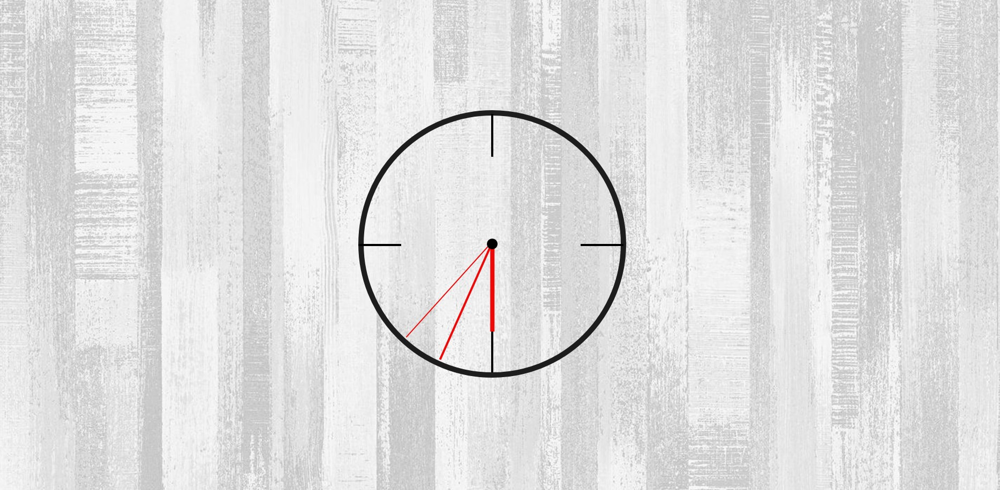

# 🥁 JavaScript - Octapad



Welcome to the JS Clock project! This project aim was to build a fully operative clock just by using **HTML, CSS (developed using Sass), JavaScript and Gulp.**

The clock matches the official time of your country and shows you the time with accuracy.

## 🌐 Link to the App.

Should you wish to take a look to the deployed app, [feel free to visit the link here](https://yarapaz.github.io/js-drum-kit/)

## 🗂️ Content

1. [Project Structure](#-project-structure)
2. [Process](#️-process)
   1. [Front-end](#-front-end)
3. [How to run the Apps](#-how-to-run-the-apps)
   1. [Pre-requeriments](#pre-requeriments)
4. [Author](#-author)

---

## 🧱 Project structure

```
/
|
|– client
|   |– src
|     |– html
|     |– images
|     |– javascript
|     |– stylesheets
```

## ⚒️ Process

### ⭐ Front-end

---

```
/
|
|– client
|   |– docs
|   |– public
|   |– src
|     |– html
|       |– partials
|         |– main.html
|       |– index.html
|     |– images
|     |– stylesheets
|       |-core
|       |–layout
```

### ✳️ SASS

I have used SASS to organise the project styles in a clear and concise way.

## 🚀 How to run the Apps.

### Pre-requeriments

To start using this project clone this repo to a new directory.

> ```console
>  $ git clone https://github.com/yarapaz/js-clock.git
> ```

### ➡️ Node

---

You have to go to the repositories folder and run npm install in order to install the necesary dependencies.

> ```console
> $ cd js-clock
> $ npm install
> ```

Once you have installed the dependencies, you are ready to run the app with `npm start`.

> ```console
> $ npm start
> ```

> 👉 Open http://localhost:3000 to view the app in the browser

Once inside you will see the clock on full screen showing you your current time.

And that's all! Enjoy and have fun!

## 👩‍💻 Author

This App has been developed by [**Yara Paz**](https://github.com/yarapaz).
